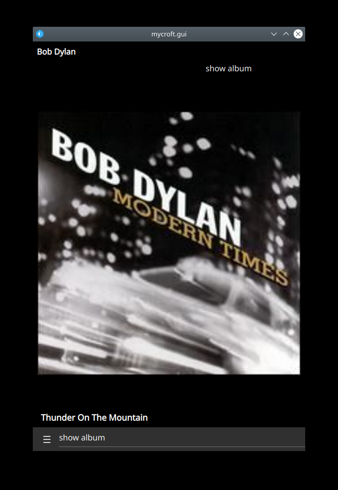

## Sonos controller skill
A simple mycroft skill to control sonos speakers
## Description 
Uses the SoCo library to control sonos speakers

You can set a default speaker in the settings, otherwise a random active speaker will be chosen at initialisation
 

## Examples 
* "sonos play"
* "sonos pause"
* "sonos next"
* "sonos previous"
* "sonos louder / volume up"
* "sonos quieter / volume down"
* "sonos shuffle on"
* "sonos shuffle off"
* "sonos playlist playlist_name"
* "sonos playlist playlist_name in the living room"
* "sonos play album album_name"
* "sonos set living room (as active speaker)"
* "search for sonos speakers"
* "show album (art)" (requires mycroft-gui)
* "sonos what's playing?"

## Credits 
* SoCo
* rapidfuzz